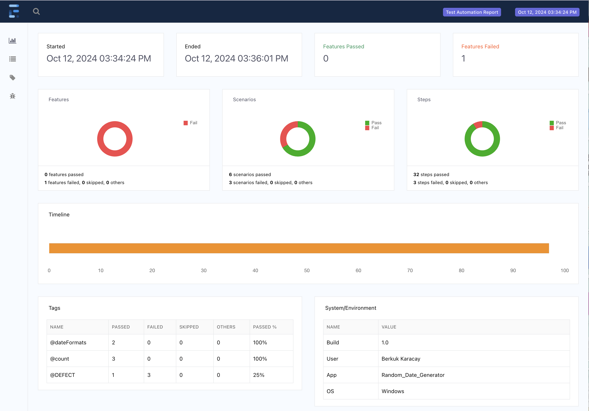

# Random Data Generator

## Overview
This project demonstrates sample tests on the [Random Data Generator](https://codebeautify.org/generate-random-date) web application. 
This site allows users to generate random dates within given criterias

## Libraries Used
- **Java 17**
- **Selenium WebDriver**
- **Cucumber**
- **WebDriverManager**
- **Extent Report**
- **Log4j & SLF4J**

## Features
1. Extent  HTML Report
2. Logging
3. Screenshot on failure
4. Singleton [Driver](src/test/java/Core/Driver.java) Class 

#### Example of Structure


#### Example of Report

<br>


## Project Structure

```markdown
src
 └── test
     └── java
         ├── Core
         │   ├── CoreObjects
         │   └── Driver
         ├── Pages
         │   └── RandomDataGeneratorPage
         ├── Runner
         │   └── TestRunner
         ├── StepDefinitions
         │   ├── GeneralStepDefinitions
         │   └── Hooks
         └── Utilities
             ├── CommonMethods
             └── ConfigurationReader
 └── test
     └── resources
         └── features
```

## Setup Instructions
1. **Clone the repository:**
    ```sh
    git clone https://github.com/siberden/random-data-generator.git
    ```

2. **Install dependencies:**
    ```sh
    mvn clean install
    ```

3. **Run tests:**
    ```sh
    mvn test
    ```

